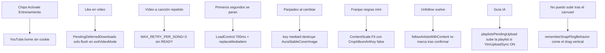

# Plan 0.6.200 — vídeo, descargas, Inicio, portadas, scroll y suscripciones

Auditoría sobre el código actual (`0.6.199`, `versionCode` 919). Las causas de abajo están **leídas en archivos vivos**, no inventadas. InnerTune/Compose/ExoPlayer se usaron solo para confirmar patrones ya presentes en este repo (p. ej. `album()` ya manda `setLogin = true`; `home()` no).

**Regla de oro de esta tanda:** cada fix debe ejecutarse en el dispositivo del dueño, con cuenta logueada, y dejar un guardián en [`docs/REGRESSION_REGISTRY.md`](docs/REGRESSION_REGISTRY.md). No tocar Superpowered/EQ, `license/`, ni `player_configs` adivinados.

---

## Mapa de síntomas → causa real

---

## 1. Vídeo: toggle, superficie negra, stall de los primeros segundos, like/descarga

**Archivos:** [`MusicService.kt`](app/src/main/kotlin/com/music/echo/playback/MusicService.kt), [`PlayerVideoSurface.kt`](app/src/main/kotlin/com/music/echo/ui/player/PlayerVideoSurface.kt), [`SongDownloadActions.kt`](app/src/main/kotlin/com/music/echo/playback/SongDownloadActions.kt), [`DownloadUtil.kt`](app/src/main/kotlin/com/music/echo/playback/DownloadUtil.kt), [`YTPlayerUtils.kt`](app/src/main/kotlin/com/music/echo/utils/YTPlayerUtils.kt), [`AuraPlayer.kt`](app/src/main/kotlin/com/music/echo/ui/newui/AuraPlayer.kt).

### 1a. Al cambiar vídeo↔música varias veces se para

Causa verificada:

- Un solo ExoPlayer; el toggle hace `replaceMediaItem` + `seek` + a veces `prepare()` ([`swapToVideo` ~7814–7884](app/src/main/kotlin/com/music/echo/playback/MusicService.kt)).
- El error de pista de vídeo solo se trata si `mediaId == videoModeMediaId`. `exitVideoMode` pone ese campo a `null` **en el mismo turno**. Un error tardío del decoder cae en `stopOnError()` / `skipOnError()`.
- `MAX_RETRY_PER_SONG = 3` solo se resetea en `STATE_READY`. Toggles rápidos nunca llegan a READY → se acumulan 3 golpes → se para.

Arreglo (no placebo):

- Guardar `lastVideoModeMediaId` hasta que el error handler haya corrido; clasificar error de renderer de vídeo aparte del de audio.
- Resetear `currentMediaIdRetryCount` al **entrar y al salir** de vídeo (un toggle no es un fallo de canción).
- Nunca `stopOnError` por un fallo de superficie/vídeo: caer a audio y dejar sonando (`exitVideoMode` + toast), igual que el comentario de `:7018` pero **sin carrera**.
- Serializar toggles: si hay un `videoSwapGeneration` en vuelo, el siguiente tap cancela el resolve viejo (ya existe el generation) **y no lanza un segundo `replaceMediaItem`** hasta que el anterior termine o se cancele.

### 1b. Tras like + cambio a vídeo: finge el cambio, solo audio

Dos causas que se suman:

1. Like en vídeo **no encola nada**: `deferWhileLiveVideo` guarda en un `ConcurrentHashMap` y **solo** `exitVideoMode()` hace flush ([`SongDownloadActions.kt:45-64`](app/src/main/kotlin/com/music/echo/playback/SongDownloadActions.kt), único call site `:8083`). Si te quedas en vídeo, el anillo gira eterno ([`AuraPlayer.kt:1481-1501`](app/src/main/kotlin/com/music/echo/ui/newui/AuraPlayer.kt)). Si sales a canción, ahí sí baja. Encaja 1:1 con lo que describes.
2. Si el like ocurre **fuera** de vídeo (o el defer se flush-ea) y luego entras a vídeo, `DownloadUtil` resuelve el mismo vídeo **sin** mirar `YTPlayerUtils.isStreamResolveBusy` → pelea el mutex de cipher/PoToken con el swap en vivo → URL distinta / 403 → `swapToVideo` pone modo vídeo pero el renderer no pinta (audio del merge sigue). Misma clase que el freeze de [#43](docs/REGRESSION_REGISTRY.md) pero por contención de red, no por `setVideoTextureView`.

Arreglo:

- **Like en un vídeo = audio + vídeo offline**, como pediste. No bloquear para siempre.
- Diferir solo **hasta que el player esté `STATE_READY` y `bufferedPosition` ≥ ~8 s** (mux estable), luego encolar. Si cambias de pista o sales de vídeo, flush inmediato de la pista que dejas (`onMediaItemTransition`, no solo `exitVideoMode`).
- Persistir la cola diferida (DataStore o tabla mínima) para que no se pierda al matar el proceso.
- `DownloadUtil` (rama `isVideoDownloadId`) debe: (1) reutilizar `videoUrlCache` del player si sigue viva; (2) **esperar** `!isStreamResolveBusy` con timeout; (3) no lanzar un segundo `/player` para el mismo id que el swap en curso.
- UI: anillo indeterminado **solo** si hay `Download.STATE_DOWNLOADING`. Si está diferido, icono de cola (“se bajará en unos segundos”), no un spinner infinito. El dueño debe ver progreso real cuando bytes se mueven.

### 1c. Stall de los primeros segundos (hay que rebobinar a mano)

Causa verificada, persistente a propósito:

- `DefaultLoadControl` arranca a **400–700 ms** ([`:2845-2850`](app/src/main/kotlin/com/music/echo/playback/MusicService.kt)). El comentario admite que se recortó un colchón de 2.5–4 s “de vídeo” para que el skip de **audio** no tardara. El vídeo 720p/1080p se come esos 700 ms y entra en `STATE_BUFFERING`. Rebobinar acierta bytes ya en `playerCache` → parece “arreglado”.
- `swapToVideo` hace `replaceMediaItem` + seek `CLOSEST_SYNC` → tira el buffer y pide un GOP nuevo.
- `ChunkingDataSource` (bypass de throttle de googlevideo, registro #91) está **solo en descargas**. El stream de vídeo usa OkHttp plano ([`videoDataSourceFactory` `:8512`](app/src/main/kotlin/com/music/echo/playback/MusicService.kt)).

Arreglo (sin repetir el placebo de #148, que ponía `playWhenReady=false` y capturaba “pausado”):

- `LoadControl` consciente de vídeo: `shouldStartPlayback` exige ~2000–2500 ms **solo si** `_videoMode`; audio se queda en 400–700 ms. **No** tocar `playWhenReady`. Si sales de vídeo a mitad del buffer, `playWhenReady` sigue true → el audio no se queda pausado (eso era #148).
- Aplicar `ChunkingDataSource` al **upstream de vídeo en vivo** (host googlevideo only, mismo gate que descargas). No aplicarlo al audio ni a Qobuz/Saavn.
- Tras `swapToVideo`, no llamar `prepare()` si el estado no es IDLE (ya está acotado); no re-seek si `sameUri`.
- No reintroducir el start-gate de pausa de #148.

**No tocar:** `INSTANT_VIDEO_SWAP_ENABLED` (sigue false), Superpowered, cipher, `forceRefreshForVideo` stub (#77) salvo usarlo.

---

## 2. Parpadeo al cambiar de canción + mini-reproductor con franjas negras

**Archivos:** [`AuraShell.kt`](app/src/main/kotlin/com/music/echo/ui/newui/AuraShell.kt), [`MiniPlayer.kt`](app/src/main/kotlin/com/music/echo/ui/player/MiniPlayer.kt), [`AuraContent.kt`](app/src/main/kotlin/com/music/echo/ui/newui/AuraContent.kt).

Causa del parpadeo: `AuraStableCoverImage` **ya** pinta el bitmap viejo debajo y desactiva el crossfade de Coil (comentario en `:293-298`: *eso* es el parpadeo). `AuraMiniPlayer` lo envuelve en `key(mediaMetadata?.id)` (`:775`) → Compose **destruye** ese estado en cada pista → plato vacío un frame. `NewMiniPlayerThumbnail` usa `AsyncImage` crudo + el mismo `key`.

Causa de las franjas: mini Aura usa `ContentScale.Fit` salvo `CropAlbumArtKey` (default **false**) (`AuraShell.kt:626,789`). Mini clásico `LegacyMiniMediaInfo` igual. El dueño pidió auto-relleno del hueco del mini, no barras.

Arreglo:

- Quitar el `key(id)` alrededor de la portada del mini (el `remember(identity)` interno ya reacciona al id).
- Mini (Aura y clásico): **siempre `ContentScale.Crop` / fillBleed** en el recuadro 40 dp. El interruptor “Recortar las portadas” **sigue valiendo** en reproductor expandido / cola / héroe (regla de [`owner-ui-preferences`](.cursor/rules/owner-ui-preferences.mdc)). El mini es un recorte de diseño, no ese ajuste.

---

## 3. Portadas: nunca vacío, siempre YouTube, siempre fill en estantes

**Archivos:** [`AuraContent.kt`](app/src/main/kotlin/com/music/echo/ui/newui/AuraContent.kt) (`AuraCover`, `upgradeAuraYoutubeCover`), [`AuraArtwork`](app/src/main/kotlin/com/music/echo/ui/newui/AuraPrimitives.kt), [`Items.kt`](app/src/main/kotlin/com/music/echo/ui/component/Items.kt), [`SyncUtils.fillMissingArtistImages`](app/src/main/kotlin/com/music/echo/utils/SyncUtils.kt), [`YouTubeUtils.resize`](app/src/main/kotlin/com/music/echo/ui/utils/YouTubeUtils.kt).

Hoy: placeholder de gradiente si no hay URL; `fillBleed` ya fuerza Crop en varios estantes; artistas sin foto se rellenan **acotados** en sync. Huecos: `fillBleed=false` por defecto en `AuraCover`; grids clásicos con Fit; canción/vídeo/playlist sin `thumbnailUrl` no caen a `https://i.ytimg.com/vi/{id}/hqdefault.jpg` (sí lo hace SearchPage).

Arreglo:

- Helper único `youtubeCoverOrFallback(videoId, thumbnailUrl)` → URL de YouTube si falta (misma cadena maxres→sd→hq que `upgradeAuraYoutubeCover`). Usarlo en `AuraCover` y en `ItemThumbnail`.
- Estantes / grids / posters / playlists / vídeos 16:9: `fillBleed = true` (regla de exploración). No Fit con barras.
- Ampliar `fillMissingArtistImages` a playlists/álbumes sin thumb en el mismo worker (tope + throttle + solo Wi‑Fi, misma disciplina de batería). No fetch por frame.

---

## 4. Chips Actívate / Entrenamiento / Relajación: a veces global, a veces tu gusto

**Archivos:** [`YouTube.home()`](innertube/src/main/kotlin/com/music/innertube/YouTube.kt) `:702-719`, [`InnerTube.browse`](innertube/src/main/kotlin/com/music/innertube/InnerTube.kt) `:312-340`, [`HomeViewModel.toggleChip`](app/src/main/kotlin/com/music/echo/viewmodels/HomeViewModel.kt) `:1234`, [`App.kt`](app/src/main/kotlin/com/music/echo/App.kt) `:595-600`.

Causa verificada (explica la intermitencia):

- `home()` llama `browse(WEB_REMIX, FEmusic_home, params)` **sin** `setLogin = true`.
- `login = setLogin || useLoginForBrowse`. El flag **default es false** (comentario: browse logueado a veces devolvía catálogo vacío; por eso se apagó para explore/home).
- Sin cookie ni `dataSyncId`, YouTube sirve el home **anónimo** (solo `visitorData`). Eso a veces parece “personal” (historial del dispositivo) y tras un refresh de `visitorData` (migración #28/#29) vuelve a genérico. Encender/apagar “Usar la cuenta para explorar” **no** recarga Inicio (solo el flag en memoria).
- Contraste: `album()` **sí** usa `setLogin = true` (`YouTube.kt:251`). InnerTune documenta el mismo patrón: sin cookie, `FEmusic_home` es público; con cookie, es el mix de la cuenta.

Arreglo (sin reactivar el flag global que vaciaba Explore):

- `YouTube.home()` y `homeContinuation()`: si hay cookie, **siempre** `setLogin = true` (cuenta: likes, suscripciones, historial YTM). Explore / new releases **no** cambian (siguen el fallback anónimo que ya existe en `newReleaseAlbums()`).
- Si el home autenticado viene **vacío**, no sustituir en silencio por el feed global: reintentar una vez; si sigue vacío, conservar el snapshot anterior y mostrar error de chip. Nunca “rellenar con lo genérico” detrás del dueño.
- Snapshot de Inicio debe incluir “¿esta página se pidió con login?”. Un snapshot guest no se muestra como si fuera de la cuenta.
- Al tocar un chip, el request lleva la misma sesión. Tras cambiar `UseLoginForBrowse`, invalidar snapshot y recargar (hoy no lo hace).
- Tests: `home()` pasa `setLogin=true` cuando `cookie != null`; con cookie null no manda Authorization.

**No** poner `useLoginForBrowse = true` por defecto otra vez: rompería Explore/álbumes nuevos (# comentario App.kt). Solo `FEmusic_home` + chips + continuación.

---

## 5. Scroll vertical muerto después de deslizar un carrusel

Causa: bug de Compose (issuetracker 236952034 / SO 77788322): un `LazyRow`/`LazyHorizontalGrid` **aún en fling** (peor con `rememberSnapFlingBehavior` en [`AuraMotion.kt:69-77`](app/src/main/kotlin/com/music/echo/ui/newui/AuraMotion.kt)) intercepta el drag vertical. Aura 1.10.2 no cancela ese fling. Sitios: Home, artista (estantería 2 filas), búsqueda, novedades.

Arreglo: un `Modifier.passVerticalToParent(state)` compartido:

- En `onPreScroll`, si `|y| > |x|` y el hijo `isScrollInProgress`, **cancelar el fling horizontal** (`state.scroll { }`) y devolver `Offset.Zero` para que el `LazyColumn` padre reciba el drag.
- Aplicarlo en `rememberAuraShelfFlingBehavior` y en `AuraDoubleRowShelf` (un solo sitio cubre casi todos los estantes). No quitar el snap (el dueño lo quiere); solo soltarlo al detectar gesto vertical.

---

## 6. Suscripciones: unfollow que vuelve, cero auto-subscribe, guía IA

**Archivos:** [`ArtistEntity.toggleLike`](app/src/main/kotlin/com/music/echo/db/entities/ArtistEntity.kt), [`DatabaseDao.followArtistsWithContent` / `confirmArtistUnsubscribed` / `playlistsPendingUpload`](app/src/main/kotlin/com/music/echo/db/DatabaseDao.kt), [`SyncUtils.executeSyncArtistsSubscriptions`](app/src/main/kotlin/com/music/echo/utils/SyncUtils.kt), [`ArtistSyncPolicy.kt`](app/src/main/kotlin/com/music/echo/utils/ArtistSyncPolicy.kt), [`LibraryUploadSync.kt`](app/src/main/kotlin/com/music/echo/utils/LibraryUploadSync.kt), [`AiPlaylistGenerator.kt`](app/src/main/kotlin/com/music/echo/playlistimport/AiPlaylistGenerator.kt), [`AccountLibraryReconcile.kt`](app/src/main/kotlin/com/music/echo/utils/AccountLibraryReconcile.kt) (aún sin cablear).

### 6a. “Me desuscribí de 10 y al volver estaban”

Dos capas, ambas reales:

1. **Lista local “Tus artistas”:** `confirmArtistUnsubscribed` **borra** `unfollowedByUserAt`. Luego el sync corre `followArtistsWithContent()`: “si tiene canciones en la biblioteca y no hay marcador, pon `bookmarkedAt`”. Los 10 vuelven a la parrilla aunque YouTube sí los haya quitado. El propio comentario del DAO (`:1566-1567`) admite que *después de honrar el unfollow una canción suya los puede volver a marcar*.
2. **Cuenta YouTube:** `subscribeChannel(...).isSuccess` es HTTP 2xx (`expectSuccess = true`). InnerTube a menudo responde 200 con error en el JSON. `channelId` vacío (`getChannelId` falla) → **return sin llamar a YouTube**. El down-sync vuelve a leer `FEmusic_library_corpus_artists` y `markArtistsSubscribedOnYtm` los restaura como suscripción real.

Arreglo:

- Tras unfollow del usuario: **no** auto-bookmark nunca más (`followArtistsWithContent` debe excluir ids con `unfollowedByUserAt` **y** un flag durable `suppressAutoBookmark` que **no** borre `confirmArtistUnsubscribed`).
- Ese suppress se limpia solo si: (a) el usuario vuelve a seguir en Aura, o (b) YouTube lista al artista otra vez **después** de un unsubscribe confirmado por re-lectura (el usuario se suscribió en youtube.com — entonces sí debe volver).
- Unsubscribe de verdad: parsear el body; si no hay éxito, **no** confirmar. Releer la lista remota (o un browse del canal) y solo entonces `confirmArtistUnsubscribed`. Si siguen ahí, dejar el pending y reintentar en `LibraryUploadSync.flushPendingUnsubscribes` (ya existe, reforzar).
- `mustCallAccountLive` se queda: un tap de unfollow **siempre** pega a la cuenta (eso es lo que quieres).

Respuesta directa a “¿YouTube quita la suscripción?”: **esa es la intención del código actual**, pero hoy puede no llegar (channelId vacío / 200 mentiroso) y la UI local te miente al devolverlos. Esta tanda cierra las dos puertas.

### 6b. Cero auto-suscripción sin tu permiso

Ya **no** hay `subscribeChannel(true)` desde el down-sync (bloque REMOVED en `SyncUtils.kt:1086-1101`). `maySubscribe` exige `followedByUserAt`. La guía IA **no** pone `followedByUserAt` al insertar ([`DatabaseDao.insert(mediaMetadata):1865-1870`](app/src/main/kotlin/com/music/echo/db/DatabaseDao.kt)).

Lo que **sí** pasa y encaja con “me auto-suscribieron un montón / me salieron en biblioteca”:

- `followArtistsWithContent` los mete en **Tus artistas** (parece suscripción).
- Si `YtmUploadSyncKey` está ON (instalación nueva: `LibraryUploadOptIn.decide` → **true**), `playlistsPendingUpload` **no** excluye playlists de la guía (solo excluye `AURA_AI_RECS`). `uploadPlaylists()` hace `YouTube.createPlaylist` + `addToPlaylist` por cada tema → aparecen en la biblioteca de YouTube Music. Eso no es `subscribeChannel`, pero en YTM “Tu biblioteca” incluye esas playlists.

Arreglo:

- Playlists creadas por la guía: marcarlas (`isLocal = 1` o `origin = AI`) y **excluirlas** de `playlistsPendingUpload`. Solo suben si el usuario pulsa “Guardar en YouTube” / sync **manual de esa lista**. Migración Spotify/otra plataforma **sí** puede seguir marcando `followedByUserAt` (excepción que pediste).
- `followArtistsWithContent`: dejar de promocionar a “Tus artistas” a todo el que tenga una canción. “Tus artistas” = `followedByUserAt` **o** suscripción remota real. El contenido de biblioteca no convierte en follow.
- Barrido: grep de `subscribeChannel(*, true)` — únicos orígenes permitidos: tap del usuario, import/migración explícita. Cualquier otro se elimina.
- Cablear [`AccountLibraryReconcile`](app/src/main/kotlin/com/music/echo/utils/AccountLibraryReconcile.kt) en `executeSyncLikedSongs`: dejar de **re-likear** en YouTube likes locales que el usuario quitó en la cuenta (el código actual `:580-589` aún hace push-up de todo). Empty-remote guard intacto (#70).

---

## 7. Pruebas que demuestran el efecto (no “compila”)

- `SongDownloadActionsTest`: defer se flush-ea en transición de pista, no solo en exit; persistencia sobrevive un “reinicio” del mapa.
- `ArtistUnfollowReachesAccountTest` + `ArtistSyncPolicyTest`: unfollow + `followArtistsWithContent` **no** los devuelve; `subscribeChannel(false)` se invoca; AI insert no deja `followedByUserAt`.
- Test de `YouTube.home` / InnerTube: cookie presente ⇒ `setLogin` efectivo (login true).
- Test de `passVerticalToParent`: preScroll vertical cancela `isScrollInProgress` del row (lógica extraída, sin Compose runtime si hace falta).
- LoadControl de vídeo: `shouldStartPlayback` false por debajo de 2 s en videoMode, true en audio (objeto extraído, testeable).

Instrumentación ExoPlayer completa no existe en este repo; el stall se verifica en dispositivo (dueño) con: entrar vídeo, no tocar seek, debe pasar los 3–5 s primeros sin parón.

---

## 8. Lo que esta tanda NO toca

- Superpowered / `eq/` / DSP.
- `license/`.
- Default global de `UseLoginForBrowse` (solo `home()`).
- `CropAlbumArtKey` en player/cola/héroe.
- Cipher / `player_configs.json` adivinado.
- `YtmUploadSyncKey` default para el resto de la biblioteca (solo se saca la guía IA del upload automático).

---

## 9. Cierre de versión (cuando el dueño dé el OK tras el plan)

Orden: implementar → tests → [`REGRESSION_REGISTRY.md`](docs/REGRESSION_REGISTRY.md) filas nuevas (toggle vídeo, stall, like-offline, chips login, unfollow durable, IA no-upload, nested scroll, mini crop/flicker) → bump `0.6.200` / `versionCode` 920 → [`RELEASE_INFO.md`](RELEASE_INFO.md) título + viñetas en español para el usuario → `pre-publish-check` READY → commit en `main` → esperar **todos** los checks verdes → **solo entonces** tag `v0.6.200`.

Hasta el tag estable: ningún aviso de “ya está lista para descargar”.
